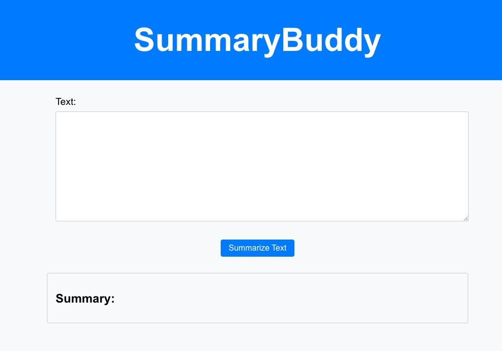

# SummaryBuddy

SummaryBuddy is a web application that enables students to easily get summarised text from news articles.



## About the project

SummaryBuddy was developed to save time trying to digest lengthy articles using Machine Learning (ML). In this digital era, an abundance of information is placed out there on the web. As such, our tool eases their information gathering process and effectiveness.

## Setup Instructions

Clone down this repository. You will need `node` and `npm` installed globally on your machine.

After cloning, please run the following command to download the required python dependencies.
```
pip3 install -r requirements.txt
```

### Client Side

Switch to Client Side (frontend) Directory:

```
cd frontend
```

Installation: `npm install`

To Start Client: `npm start`

To Visit App: `localhost:3000/`

### Server Side
Switch to Server Side (backend) Directory:
```
cd backend
```
Start the Backend API: `python3 app.py`
> The backend server should be set up on `http://127.0.0.1:5000`


## How it works

Our Machine Learning(ML) Model is trained on the `multi_news` dataset allowing our model to produce summaries that are accurate and precise over a wide-range of topics.

We also created a website which has fields to make use of `REST` to connect to get an output from our ML model.

## Tech Stack

<div align="center">
  <code></code>
  <code></code>
  <code></code>
</div>

## Collaborators

[Merrickneo](https://github.com/Merrickneo)
[kavantan](https://github.com/kavantan)
[leirdas](https://github.com/leirdas)
[senwei01](https://github.com/senwei01)
